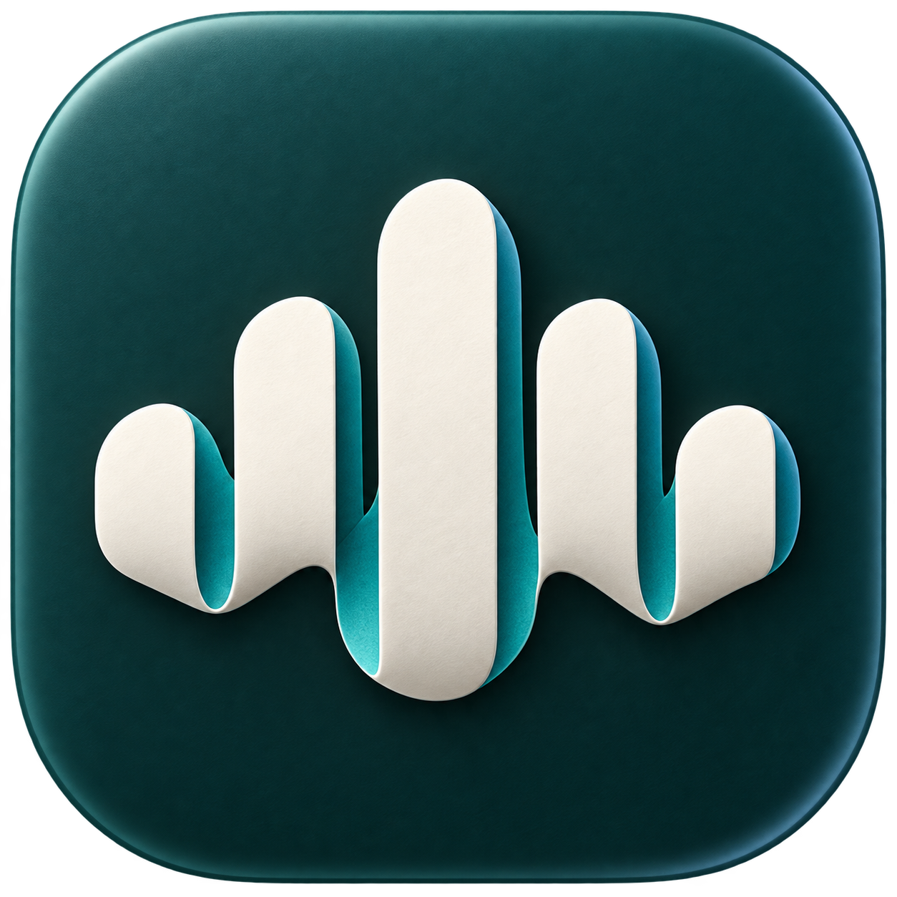
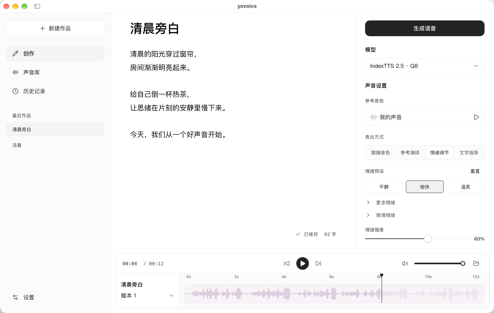
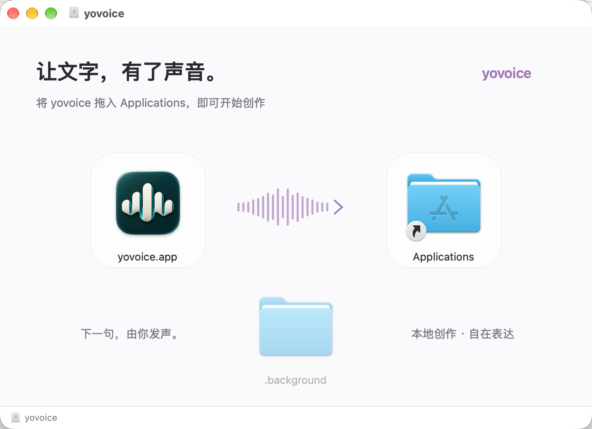

<p align="center">
  
</p>
<h1 align="center">yovoice</h1>
<p align="center">让文字拥有你的声音。</p>
<p align="center">
  <a href="web/package.json"></a>
  <a href="LICENSE"></a>
  
  
</p>
<p align="center"><a href="README.md">English</a> · 简体中文</p>

---

yovoice 是一款适用于 macOS 和 Windows 的开源声音创作工具，在本地将文字转化为自然、富有表现力的语音。支持音色复刻、情绪控制与音频作品管理，可自主选择 TTS 模型，无需调用云端 API，也没有按字数计费的开销，让旁白、配音和有声内容创作更自主、更低成本。



---

## 功能

- **音色与表达** — 跟随参考音色、模仿参考演绎、调整情绪，或用文字描述想要的表达方式。
- **完整音频流程** — 导入或录制参考音频、裁剪片段、试听语音、导出作品。
- **声音设计与克隆** — VoxCPM2 支持文字设计音色、带风格指导的克隆及参考原文辅助的精细克隆，自动多语言、48 kHz 输出。
- **本地模型** — 通过 audio.cpp 运行 IndexTTS 2.0 / 2.5、VoxCPM2、OmniVoice 和 Qwen3-TTS，支持模型下载续传与 GGUF 导入。
- **硬件加速** — Apple Silicon 支持 Metal；Windows 支持 CPU、NVIDIA CUDA 和实验性 Vulkan。
- **Agent Skill** — 让 AI Agent 准备本地语音生成环境，根据文稿和参考音频完成配音。

---

## 支持模型

| 模型 | 核心能力 |
| --- | --- |
| IndexTTS 2.0 | 中英音色克隆、情绪控制、参考演绎 |
| IndexTTS 2.5 | 多语言音色克隆、情绪控制、发音调整 |
| VoxCPM2 | 文字设计音色、音色克隆、参考原文辅助的精细克隆 |
| OmniVoice | 属性设计音色、音色克隆、非语言声音标签 |
| Qwen3-TTS Base · 0.6B / 1.7B | 参考音色克隆、可选原文辅助、多语言生成 |
| Qwen3-TTS CustomVoice · 1.7B | 9 种内置音色、文字控制风格与情绪 |
| Qwen3-TTS VoiceDesign · 1.7B | 自然语言描述设计音色，无需参考音频 |

App 与 CLI 均支持以上模型，详细精度与参数见[模型能力说明](skills/yovoice/references/models.md)。OmniVoice 权重采用 CC-BY-NC 许可，仅限非商业用途。

---

## 安装

在仓库的 [Releases](../../releases) 页面选择对应平台的安装包。

| 平台 | 安装包 | 安装方式 |
| --- | --- | --- |
| macOS 14+ · Apple Silicon | `.dmg` | 打开磁盘映像，将 yovoice 拖入 Applications |
| Windows 10/11 · x64 | `-setup.exe` | 运行安装向导，安装后从开始菜单打开 |

Windows 安装器会在缺少时联网安装 [WebView2 Runtime](https://developer.microsoft.com/microsoft-edge/webview2/)。模型在应用内下载。卸载应用保留 `~/.yovoice` 中的作品和模型。

macOS 和 Windows 均支持在应用菜单中检查更新，也会自动检查并后台下载；下载完成后可选择重启安装。



---

## 快速上手

1. **准备模型。** 在设置中下载所需模型，Windows 已内置 CPU 内核，可在设置中下载 CUDA 内核以使用 NVIDIA GPU 加速。
2. **添加音色。** 导入或录制一段 1–60 秒的参考音频，或使用 VoxCPM2 / OmniVoice / Qwen3-TTS VoiceDesign 无参考音频的声音设计。
3. **生成语音。** 输入正文，选择表达方式，点击生成。
4. **试听与导出。** 预览生成结果，在历史记录中查找以往作品。

作品、音色与设置保存在 `~/.yovoice`。

---

## CLI 与 Agent Skill

将 [yovoice Skill](https://github.com/leemysw/yovoice/tree/main/skills/yovoice) 链接发给 Agent，让它安装 Skill，并准备本地 CLI、引擎和模型：

> 安装这个 Skill，并帮我配置好 yovoice 本地语音生成环境：https://github.com/leemysw/yovoice/tree/main/skills/yovoice

之后直接描述需求：

> 用 voice.wav 的音色朗读 narration.txt，语气平静，保存为 narration.wav。

Agent 通过独立 CLI 完成配音，无需打开桌面应用。详细用法见 [CLI 指南](docs/cli.md)。

---

## 开发

```sh
make install
make app-run
```

环境要求见[开发指南](docs/development.md)，其中也介绍了浏览器预览、测试和项目结构。

---

## 参与贡献

欢迎提交问题、功能建议和 Pull Request。报告问题时，请附上操作系统、模型及复现步骤；提交代码前运行 `make check`。

---

## 鸣谢

- [audio.cpp](https://github.com/0xShug0/audio.cpp) — ShugoAI 开发的本地音频推理引擎。
- [VoxCPM](https://github.com/OpenBMB/VoxCPM) — 声音设计与克隆模型，Apache-2.0 许可。
- [IndexTTS](https://github.com/index-tts/index-tts) — 为 yovoice 提供语音合成模型。
- [OmniVoice](https://github.com/k2-fsa/OmniVoice) — 声音设计与音色克隆模型。
- [Qwen3-TTS](https://github.com/QwenLM/Qwen3-TTS) — 支持音色克隆、内置音色与文字设计声音。
- Kokoro — 使用内置音色的轻量语音合成模型：[Kokoro-82M](https://huggingface.co/hexgrad/Kokoro-82M) 与 [Kokoro-82M-v1.1-zh](https://huggingface.co/hexgrad/Kokoro-82M-v1.1-zh)。

---

## 开源协议

[Apache-2.0](LICENSE)。依赖组件保留[各自的许可证](THIRD_PARTY_NOTICES.md)，IndexTTS 模型单独遵循其[模型使用许可协议](web/public/model-license.txt)。
